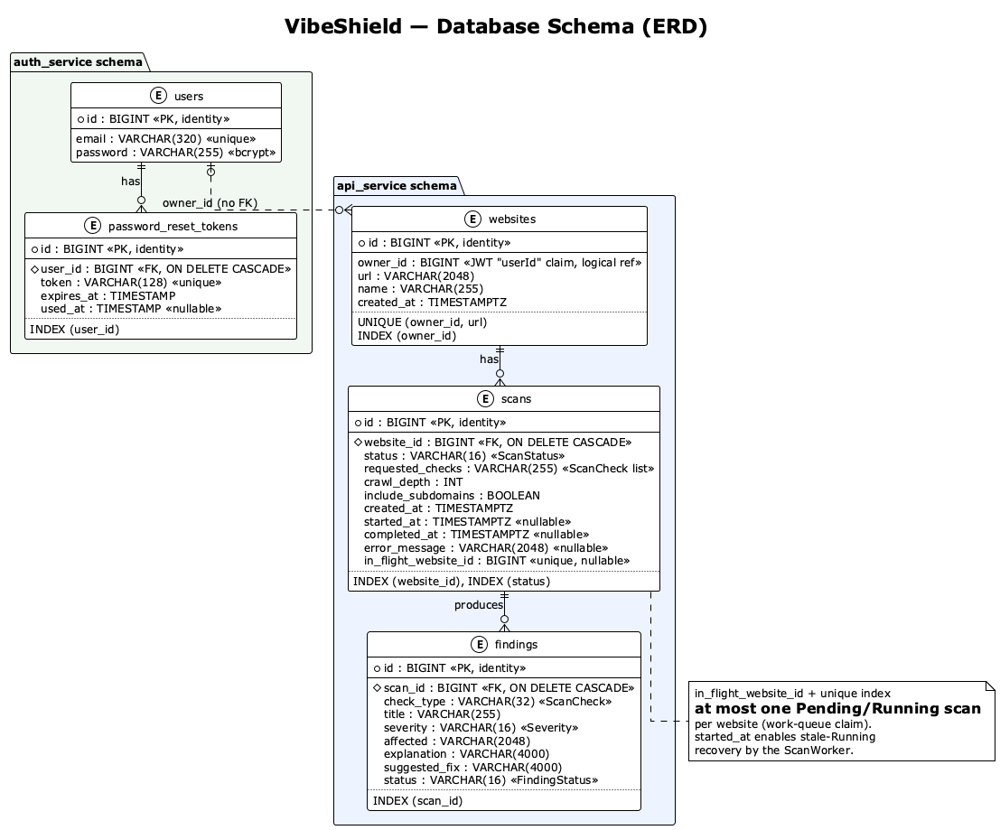

# VibeShield

Security scanning for sites built with AI — findings come with ready-to-paste fix prompts for your AI builder.

**Live app:** https://ge65poj.stud.k8s.aet.cit.tum.de  
**Grafana dashboard:** https://ge65poj-monitoring.stud.k8s.aet.cit.tum.de  
**API docs:** https://ge65poj.stud.k8s.aet.cit.tum.de/api/swagger-ui.html

---

## What it does

Non-technical "vibecoders" ship live sites with AI tools (Lovable, Cursor, v0, Bolt, Replit) that routinely leak API keys, skip HTTPS, expose admin pages, or leave Supabase tables without RLS — and have no way to tell. VibeShield runs a surface-level security scan, shows findings grouped by severity, and generates a ready-to-paste fix prompt per finding so the user can repair the site by asking the same AI that built it.

---

## Architecture

```
Browser → Nginx gateway → React client (Vite + TypeScript)
                        → api-service    (Spring Boot 3, Java 21)  → PostgreSQL 16
                        → auth-service   (Spring Boot 3, Java 21)  → PostgreSQL 16
                        → langchain-service (Python + FastAPI + LangChain) → OpenAI / local LLM
                        ↑ api-service calls scanner-service internally
                        → scanner-service (Spring Boot 3, Java 21)
```

| Service | Tech | Port | Responsibility |
|---|---|---|---|
| [client](docs/client.md) | React + Vite + TypeScript, Nginx | 3000 | User-facing UI |
| [api-service](docs/api.md) | Spring Boot 3, Java 21 | 8080 | REST API, scan orchestration, JWT validation |
| [auth-service](docs/auth.md) | Spring Boot 3, Java 21 | 8080 | Registration, login, password reset, JWT issuance |
| [scanner-service](docs/scanner.md) | Spring Boot 3, Java 21 | 8080 | Security checks (internal-only) |
| [langchain-service](docs/langchain.md) | Python 3.12, FastAPI, LangChain | 8000 | AI fix-prompt generation (OpenAI cloud + self-hosted Ollama local model + TUM Logos) |
| [gateway](docs/gateway.md) | Nginx | 80 / 443 | Single-origin reverse proxy in front of all services |
| database | PostgreSQL 16 | 5432 | Persistent storage (schema-per-service isolation) |

> Per-service reference docs live in [`docs/`](docs/): [client](docs/client.md) ·
> [api-service](docs/api.md) · [auth-service](docs/auth.md) ·
> [scanner-service](docs/scanner.md) · [langchain-service](docs/langchain.md) ·
> [gateway](docs/gateway.md).

---

## Local setup

**Prerequisites:** Docker + Docker Compose

```bash
cp .env.example .env          # see note below before you skip straight to docker compose
docker compose up --build     # starts all services + gateway on http://localhost:3000
```

> **The GenAI feature needs a provider key, and the UI's default provider is
> `logos`, not OpenAI.** Filling in only `OPENAI_API_KEY` in `.env` is not
> enough on its own — the fix-prompt/chat UI defaults to the TUM Logos
> provider (`client/src/hooks/useLlmProvider.ts`), and `LOGOS_API_KEY` is
> blank in `.env.example`. Either:
> - set `LOGOS_API_KEY` too (course-provided), or
> - fill in `OPENAI_API_KEY` and switch the provider dropdown to **OpenAI**
>   in the UI before generating a fix prompt
>
> Without one of those, the first fix-prompt/chat request returns
> `503 PROVIDER_NOT_CONFIGURED`. `APP_JWT_SECRET` already has a working dev
> default in `.env.example` — only change it if you have a reason to.

The gateway exposes everything on port `3000`. API docs are at `http://localhost:3000/api/swagger-ui.html`.

### Running with or without the self-hosted model (Ollama)

The GenAI service offers three LLM providers — **OpenAI** (cloud), **TUM Logos**
(course gateway), and **Self-hosted (Ollama)** (a local model we run ourselves).
The Ollama runtime is heavy (multi-GB model download, slow CPU inference), so it's
gated behind a Docker Compose [profile](https://docs.docker.com/compose/how-tos/profiles/)
named `ollama` and is **off by default**.

**Without Ollama (default):**

```bash
docker compose up --build
```

Starts every service *except* the `ollama` container. The app is fully functional
and the **OpenAI** and **TUM Logos** providers work normally. Only the
**Self-hosted (Ollama)** provider has no backend in this mode — selecting it in the
UI fails (the langchain-service can't reach `http://ollama:11434` and returns a
`500`), so leave the provider dropdown on OpenAI or TUM Logos. To make that failure
a clean `503 PROVIDER_NOT_CONFIGURED` instead, blank `SELFHOSTED_API_KEY` in `.env`.

**With Ollama:**

```bash
docker compose --profile ollama up --build      # or: COMPOSE_PROFILES=ollama docker compose up --build
```

Also starts the `ollama` container. On **first boot** it pulls the model
(`SELFHOSTED_MODEL_NAME`, default `llama3.2:3b`, ~2 GB) and prewarms it into memory,
which takes a few minutes — later starts are fast because the weights are cached in
the `ollama_models` volume. Once it's up, the **Self-hosted (Ollama)** provider works.
CPU-only inference is slow, so keep to small models (1B–3B).

> Combine profiles with the monitoring overlay if you need both:
> `docker compose --profile ollama -f docker-compose.yml -f docker-compose.monitoring.yml up --build`

To include the monitoring stack (Prometheus, Grafana, Loki):

```bash
docker compose -f docker-compose.yml -f docker-compose.monitoring.yml up --build
```

Grafana runs at `http://localhost:3001` (admin / admin for local dev).

---

## Database schema

Two logical schemas in one PostgreSQL instance, plus an optional third for the
GenAI RAG knowledge base (see below). Full ERD (auth/api only):
[`docs/db-schema.png`](docs/db-schema.png)



**`auth_service` schema**
| Table | Key columns |
|---|---|
| `users` | `id`, `email`, `password` (bcrypt) |
| `password_reset_tokens` | `id`, `user_id`, `token`, `expires_at`, `used_at` |

**`api_service` schema**
| Table | Key columns |
|---|---|
| `websites` | `id`, `owner_id` (from the JWT's `userId` claim), `url`, `name`, `created_at` |
| `scans` | `id`, `website_id`, `status`, `requested_checks`, `crawl_depth`, `started_at`, `completed_at` |
| `findings` | `id`, `scan_id`, `check_type`, `title`, `severity`, `affected`, `explanation`, `suggested_fix`, `status` |

Schema is managed by Flyway migrations in each service (`services/*/src/main/resources/db/migration/`).

**`langchain_service` schema (optional, RAG only)** — created automatically on
startup when `DATABASE_URL` is set; the service runs fine without it.
| Table | Key columns |
|---|---|
| `fix_prompt_knowledge` | `id`, `check_type`, `source`, `title`, `content`, `embedding vector(1536)` |

See [`docs/langchain.md`](docs/langchain.md#rag-knowledge-base) for how this is
populated and used.

---

## CI/CD

**CI** runs on every PR targeting `main`, and again on the resulting merge commit (`.github/workflows/ci.yml`):
- OpenAPI spec lint (Redocly) + drift check (generated code matches spec)
- Build + test: api-service, auth-service, scanner-service (Gradle), client (Vitest), langchain-service (pytest)

**CD** runs on merge to `main` (`.github/workflows/cd.yml`):
1. Builds and pushes all service images to GHCR tagged `sha-<commit>` + `latest` (semver tags added automatically when a `v*` git tag is pushed)
2. Deploys to Kubernetes via Helm (`helm upgrade --install vibeshield ./helm/vibeshield`)
3. Deploys the monitoring stack — applies each manifest under `k8s/monitoring/` individually, in dependency order (configmaps/PVCs before deployments), into the `ge65poj` namespace alongside the app

Required GitHub Actions secrets: `KUBECONFIG_AET`, `POSTGRES_PASSWORD`, `APP_JWT_SECRET`, `OPENAI_API_KEY`, `LOGOS_API_KEY`.

---

## Monitoring

Deployed to the `ge65poj` namespace alongside the app.

- **Prometheus** — scrapes `/actuator/prometheus` (Spring Boot) and `/metrics` (FastAPI) from all services
- **Grafana** — live dashboard at https://ge65poj-monitoring.stud.k8s.aet.cit.tum.de (provisioned from `k8s/monitoring/grafana-dashboard-configmap.yml`)
- **Loki + Promtail** — log aggregation from all pods
- **Alert rules** (`k8s/monitoring/prometheus-configmap.yml`): ServiceDown (1 min),
  HighErrorRate (>5% 5xx, 2 min), SlowResponseTime (P95 > 2s, 5 min) for the Spring
  services, plus GenAIHighErrorRate / GenAISlowResponseTime for the FastAPI GenAI service
- **Alertmanager** — Prometheus routes firing alerts to Alertmanager, which groups and
  deduplicates them and shows them at https://ge65poj-alertmanager.stud.k8s.aet.cit.tum.de.
  Delivery is UI-only by design (no external SMTP/Slack channel provisioned); the receiver
  in `k8s/monitoring/alertmanager-configmap.yml` is ready to take an email/Slack/webhook
  integration if one is added later. Silences and notification state persist on a PVC,
  and CD restarts Prometheus + Alertmanager after applying their ConfigMaps so config
  changes actually take effect (neither reloads a mounted file on its own).

---

## Running tests

```bash
# Spring Boot services (no Gradle wrapper committed — uses a system-installed
# Gradle matching the version the Dockerfiles build with, currently 8.10.2)
cd services/api-service && gradle test
cd services/auth-service && gradle test
cd services/scanner-service && gradle test

# Python GenAI service (requirements-dev.txt = app requirements + pytest)
cd services/langchain-service && pip install -r requirements-dev.txt && python -m pytest

# React client
cd client && npm ci && npm test
```

All of the above run automatically in CI on every PR.

---

## Kubernetes deployment

The app is deployed to the TUM course cluster (Rancher) under namespace `ge65poj`.
CD does this automatically on every merge to `main`; the same commands can be
run manually (e.g. to test a branch before merging), given a kubeconfig
already scoped to `ge65poj`.

> **`-n ge65poj` is required, not optional.** Course-cluster accounts are
> namespace-scoped — omitting it silently targets the `default` namespace
> instead, where you have no permissions, and fails with a confusing
> `"forbidden ... in the namespace default"` error rather than an obvious
> "wrong namespace" message.

```bash
# Deploy app — pin images.tag to a real tag from GHCR (e.g. sha-<commit>);
# omitting it deploys whatever :latest currently is, which may not be what
# you expect.
helm upgrade --install vibeshield ./helm/vibeshield -n ge65poj \
  --set-string images.tag=<tag> \
  --set-string secrets.jwtSecret=<secret> \
  --set-string secrets.dbPassword=<password> \
  --set-string secrets.openaiApiKey=<key> \
  --set-string secrets.logosApiKey=<key>

# Deploy monitoring — apply each manifest individually, same as CD; skip
# rbac.yml (grants node-level metrics access; course accounts can't apply
# it — Kubernetes blocks granting RBAC permissions you don't already hold
# at that scope — so it fails with "attempting to grant RBAC permissions
# not currently held" for any team member, including CD).
kubectl create serviceaccount prometheus -n ge65poj --dry-run=client -o yaml | kubectl apply -f -
kubectl apply -f k8s/monitoring/prometheus-configmap.yml -n ge65poj
kubectl apply -f k8s/monitoring/prometheus-pvc.yml -n ge65poj
kubectl apply -f k8s/monitoring/prometheus-deployment.yml -n ge65poj
kubectl apply -f k8s/monitoring/prometheus-service.yml -n ge65poj
kubectl apply -f k8s/monitoring/loki-configmap.yml -n ge65poj
kubectl apply -f k8s/monitoring/loki-pvc.yml -n ge65poj
kubectl apply -f k8s/monitoring/loki-deployment.yml -n ge65poj
kubectl apply -f k8s/monitoring/loki-service.yml -n ge65poj
kubectl apply -f k8s/monitoring/promtail-configmap.yml -n ge65poj
kubectl apply -f k8s/monitoring/promtail-daemonset.yml -n ge65poj
kubectl apply -f k8s/monitoring/grafana-secret.yml -n ge65poj
kubectl apply -f k8s/monitoring/grafana-configmap.yml -n ge65poj
kubectl apply -f k8s/monitoring/grafana-dashboard-configmap.yml -n ge65poj
kubectl apply -f k8s/monitoring/grafana-pvc.yml -n ge65poj
kubectl apply -f k8s/monitoring/grafana-deployment.yml -n ge65poj
kubectl apply -f k8s/monitoring/grafana-service.yml -n ge65poj
kubectl apply -f k8s/monitoring/grafana-ingress.yml -n ge65poj
```

> **If `helm upgrade` fails with `"invalid ownership metadata"`:** the
> `vibeshield-secrets` Secret was touched outside Helm (e.g. a direct
> `kubectl apply`/`kubectl edit`) and lost its Helm-managed ownership
> annotations. Re-adopt it before retrying:
> ```bash
> kubectl annotate secret vibeshield-secrets -n ge65poj \
>   meta.helm.sh/release-name=vibeshield \
>   meta.helm.sh/release-namespace=ge65poj --overwrite
> kubectl label secret vibeshield-secrets -n ge65poj \
>   app.kubernetes.io/managed-by=Helm --overwrite
> ```

Helm charts are in `helm/vibeshield/`. Kubernetes manifests for monitoring are in `k8s/monitoring/`.

---

## Azure VM deployment

The second required cloud target: a plain Azure VM running the same Docker
Compose stack as local dev (not Kubernetes). Deploys automatically on every
merge to `main` via `.github/workflows/deploy.yml`, which SSHes in, copies
the repo, writes a `.env` from secrets, and runs `docker compose up -d --build`.

Required GitHub Actions secrets: `AZURE_PUBLIC_IP`, `AZURE_USER`,
`AZURE_PRIVATE_KEY`, `POSTGRES_PASSWORD`, `APP_JWT_SECRET`, `OPENAI_API_KEY`.

The VM itself isn't provisioned by CI — it's a standalone Azure VM someone
sets up once (see the TUM Azure4Students guide), matching the port mapping
in `docker-compose.yml` (`3000:80`, `3443:443` on the gateway) with inbound
NSG rules for `22` and `3000` open, and a **static** public IP so the
`AZURE_PUBLIC_IP` secret doesn't silently go stale on a VM restart.

---

## Per-student responsibilities

| Student | Area |
|---|---|
| Aziz Chouria | DevOps & infrastructure: CI/CD pipelines (GitHub Actions), Kubernetes/Helm deployment, Azure (Terraform + Ansible), monitoring stack (Prometheus + Grafana + Loki), security hardening; auth-service register/login/JWT/password-reset endpoints and authentication/onboarding flow |
| Julian Jungnitz | API design (OpenAPI contract + codegen), scanner-service core & scan lifecycle/worker, **GenAI integration** (langchain-service providers), client scan/analysis workflows and UI redesign, auth-service JWT validation in api-service, autoscaling & health probes, UML diagrams |
| Tim Dreher | **Scanner-service security checks, rescan & comparison + report/PDF exports**, **GenAI fix-prompt hardening/guardrails & semantic RAG knowledge base**, database, cross-stack test suites (JUnit + pytest + Vitest), gateway resilience |

> auth-service is a shared responsibility: Aziz owns the auth-service endpoints (register/login/reset, JWT issuance); Julian owns JWT validation and enforcement in api-service.
